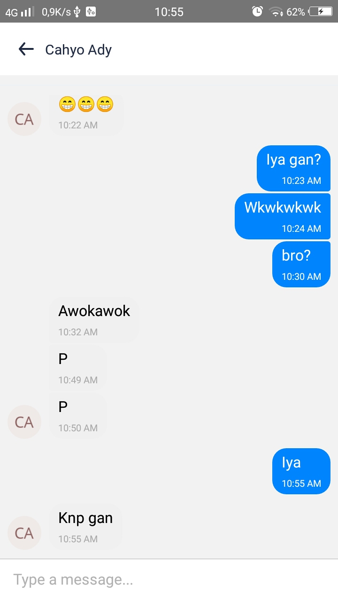

<p align="center">
  
</p>
<p align="center">
  Firechat name inspired from <strong>Enen no Shouboutai</strong>.<br/>
  <a href="https://myanimelist.net/anime/38671/Enen_no_Shouboutai">Fire Force</a>
</p>


[](https://github.com/chlasswg26/)


[](https://github.com/chlasswg26/Firechat/)

---

## Features

- Works on Android
- Maps (Show your location & contact location)
- Contact (Show contact)
- Realtime Chat

Currently supported React Native version: `>= 0.60.0`

### Dependencies

List of dependencies using this project.

| Name | Repository |
| ------ | ------ |
| React Native | [facebook/react-native](https://facebook.github.io/react-native/) |
| Firebase | [Firebase SDK](https://www.npmjs.com/package/firebase) |
| UI Kitten | [akveo/react-native-ui-kitten](https://github.com/akveo/react-native-ui-kitten/) |
| Maps | [react-native-community/react-native-maps](https://github.com/react-native-community/react-native-maps) |
| Gifted Chat | [FaridSafi/react-native-gifted-chat](https://github.com/FaridSafi/react-native-gifted-chat) |

## Requirements

* [`yarn`](https://yarnpkg.com/getting-started/install) or [`npm`](https://www.npmjs.com/)
* [`react-native`](https://facebook.github.io/react-native/docs/getting-started)
* `Google maps API Key` you can get it [here](https://developers.google.com/maps/documentation/javascript/get-api-key)
* `Config realtime database firebase for WEB` you can get it [here](https://firebase.google.com/)

## Initial setup

Open `.ENV` and replace with your config
```shell
SITE_TITLE='Firechat'

FIREBASE_APIKEY=''
FIREBASE_AUTHDOMAIN=''
FIREBASE_DATABASEURL=''
FIREBASE_PROJECTID=''
FIREBASE_STORAGEBUCKET=''
FIREBASE_MESSAGINGSENDERID=''
FIREBASE_APPID=''
FIREBASE_MEASUREMENTID=''
```

## Usage for development

1. Open your terminal or command prompt
2. Type `git clone https://github.com/chlasswg26/Firechat.git`
3. Open the folder and type `yarn install or npm install` for install dependencies
4. Add your goole maps API Key on `AndroidManifest.xml`
##### Example
  ```
  <meta-data
        android:name="com.google.android.geo.API_KEY"
        android:value="YOUR_API_KEY"/>
  ```
6. Type `react-native run-android` for run this app. ***Make sure your device is connected with debugging mode***.
7. Well done..

## Release APK

<a href="https://drive.google.com/file/d/1WHvMc0kSENALi_Ucqd3CTNM3gov5MN95/view?usp=sharing">
  
</a>


## Screenshot

<kbd>

</kbd>

<kbd>

</kbd>

<kbd>

</kbd>

<kbd>

</kbd>

<kbd>

</kbd>

## CREDIT

Icons made by <a href="https://www.flaticon.com/authors/good-ware" title="Good Ware">Good Ware</a> from <a href="https://www.flaticon.com/" title="Flaticon"> www.flaticon.com</a>
